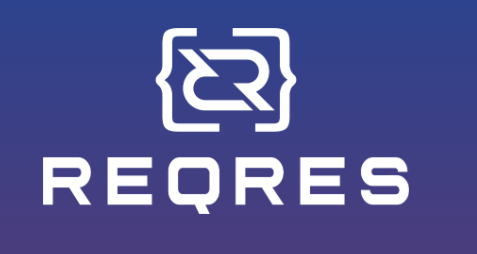
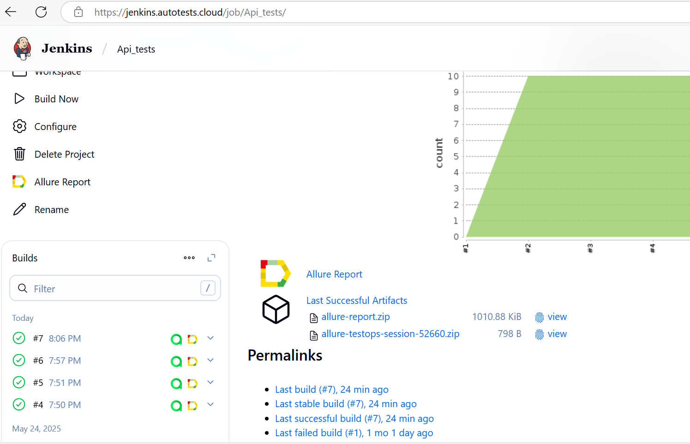
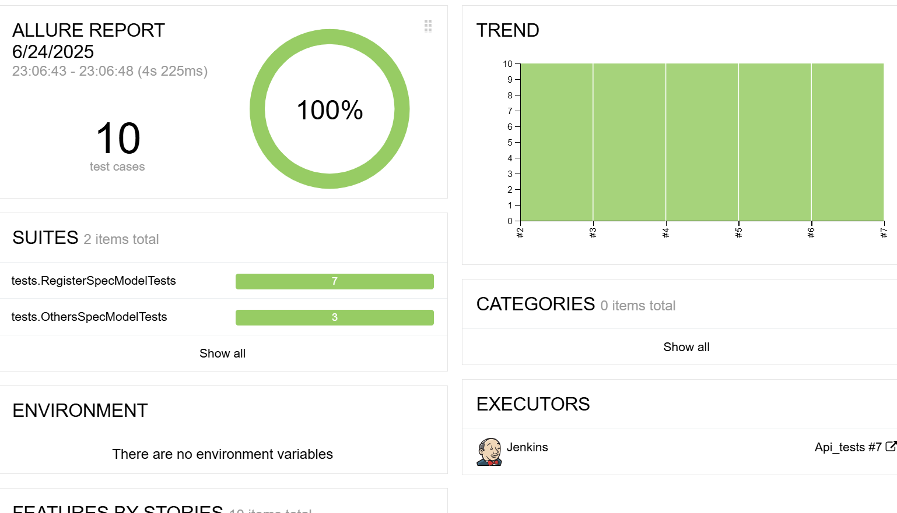
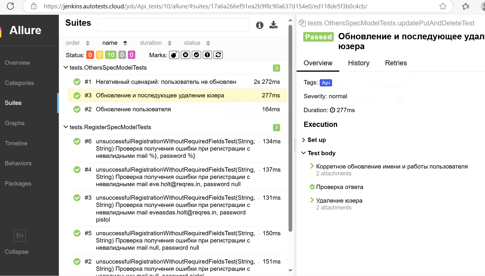
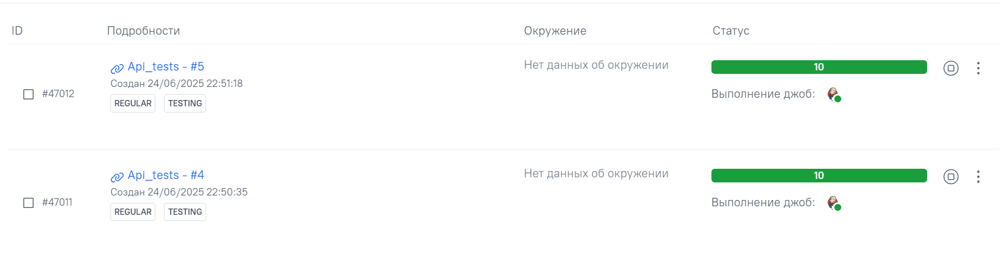
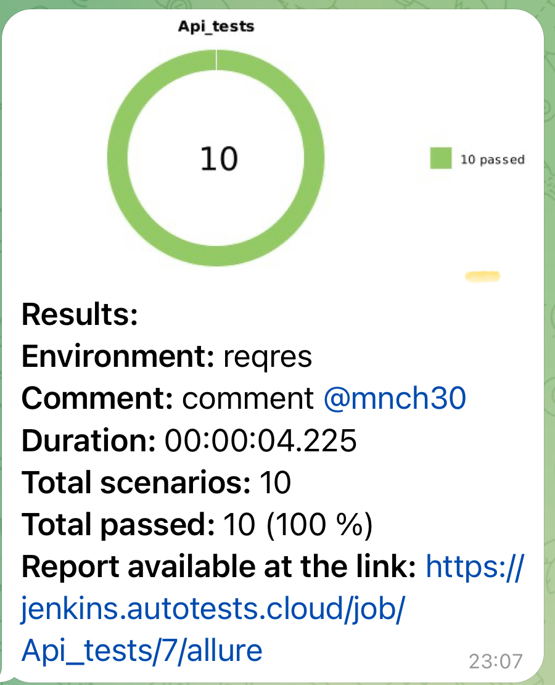

<a href="https://ifellow.ru/"></a>

<h1 >Демопроект по автоматизации тестирования для <a href="https://reqres.in/">reqres</a></h1>

## ☑️ Содержание:

- Технологии и инструменты
- Список проверок, реализованных в тестах
- Запуск тестов в Jenkins и из терминала
- Allure-отчет
- Allure TestOps-отчет
- Уведомление в Telegram о результатах прогона тестов


<a id="tools"></a>
## :ballot_box_with_check:Технологии и инструменты:

## Технологии и инструменты
<p>
  <a href="https://www.jetbrains.com/idea/"></a>
  <a href="https://github.com/"></a>
  <a href="https://www.java.com/"></a>
  <a href="https://gradle.org/"></a>
  <a href="https://junit.org/junit5/"></a>
  <a href="https://rest-assured.io/"></a>
  <a href="https://www.jenkins.io/"></a>
  <a href="https://github.com/allure-framework/"></a>
  <a href="https://qameta.io/"></a>
  <a href="https://telegram.org/"></a>
</p>


## :ballot_box_with_check:Реализованные проверки:

- ### Авторизация
- 🔑 Успешный вход и проверка токена
- 🔒 Неудачные попытки входа с невалидным эмейлом и паролем, отсутствием пароля или эмейла

### Пользователи
- ✅ Корретное обновление имени и работы пользователя
- ✅ Корретное обновление имени и работы пользователя(patch)
- ✅ Невалидные данные пользователя в апдейте

##  Сборка в [Jenkins](https://jenkins.autotests.cloud/job/Api_tests/)


<p align="center">  
</a>  
</p>


## :ballot_box_with_check: Параметры сборки в Jenkins:

- browser (браузер, по умолчанию chrome)
- browserVersion (версия браузера, по умолчанию 127.0)
- browserSize (размер окна браузера, по умолчанию 1920x1080)


## Команды для запуска из терминала

Локальный запуск:
```bash  
gradle clean Api_test
```
``
Удаленный запуск через Jenkins:
```bash  
clean
Api_test
```

## </a>  <a name="Allure"></a>Allure Report	</a>


## Основная страница отчёта

<p align="center">  
  
</p>  

## Тест-кейсы

<p align="center">  
  
</p>
____

## </a> Allure-testops
На Dashboard в Allure TestOps удобно отслеживать статистику по тестам: сколько добавлено, какие ручные, а какие автоматизированы. Платформа позволяет легко запускать нужные тесты, анализировать результаты и управлять тестированием в одном месте — это значительно упрощает работу команды и повышает её эффективность.
____
<p align="center">  
  
</p>

____

## </a> Уведомление в Telegram при помощи бота
____
<p align="center">  
  
</p>
